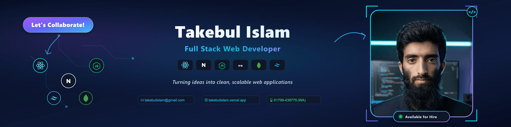

<!--- banner --->

  

 

<!--- title & typing svg --->

  <ul align="center">
    
<h1 style="display: inline-block">Hi 👋, I'm Takebul Islam</h1>

    <!--- animated typing headline --->
    
  </ul>

 

<!--- about --->

- 👋 Hi, I’m **[@takebul](https://github.com/takebul)** (Takebul Islam)
- 🖥️ I’m currently architecting frontend systems with **React 19, Next.js 16, JavaScript (ES6+), and Tailwind CSS v4**.
- 🗄️ Using **Node.js, Express.js, MongoDB Atlas, and REST APIs** for resilient microservices and backend databases.
- 🔐 Skilled in implementing **Better Auth, Stateless JWT with Remote JWKS, and Stripe Subscription Payments with Webhooks**.
- ⚡ Specializing in **complex business logic, Role-Based Access Control (RBAC), and 60fps kinetic UI physics**.
- 🌐 Explore My Live Portfolio: **[takebulislam.vercel.app](https://takebulislam.vercel.app)**
- 📄 Check out My **[Interactive Resume](https://docs.google.com/document/d/1WRY3zXw2sC7Yz-AT9gkw7APiPQ5o9vRXBxy0EzppeZY)**
- 💬 Connect on Discord: **[discord.com/invite/takebulislam](https://discord.com/invite/takebulislam)**
- 📱 Direct Call or WhatsApp: **[+880 1799-439775](https://wa.me/8801799439775)**
- 📫 Feel free to reach me out at **[takebulislam@gmail.com](mailto:takebulislam@gmail.com)**

 

<!--- socials --->

## <b> FOLLOW ME ON SOCIALS:</b>

  

    
    
    
    
    
    
  

 

<!--- technology stack --->

## <b> TECHNOLOGY STACK:</b>

### Languages:

### CSS Frameworks & Libraries:

### JavaScript Frameworks & Libraries:

### Database & Cloud Storage:

### Deployment Platforms:

### Tools & Technologies:

 

<!--- featured production projects --->

## <b> FEATURED PRODUCTION PROJECTS:</b>

### 1. 🏢 StartupForge — Two-Sided Founder & Collaborator Marketplace

- **Live Site:** [startupforgelimited.vercel.app](https://startupforgelimited.vercel.app)
- **Client Code:** [github.com/takebul/startup-forge-client](https://github.com/takebul/startup-forge-client)
- **Server Code:** [github.com/takebul/startup-forge-server](https://github.com/takebul/startup-forge-server)
- **Tech Stack:** Next.js 16, React 19, Node.js, Express.js, MongoDB Atlas, Better Auth, Stripe, Recharts, Framer Motion, Tailwind CSS.
- **Key Feats:** Role-based dashboards (Founder, Collaborator, Admin), strict RBAC token middleware, and Stripe automated subscription webhooks.

### 2. 🎓 TutorBook — Verified On-Demand Tutor Booking Platform

- **Live Site:** [tutor-booking-client.vercel.app](https://tutor-booking-client.vercel.app)
- **Client Code:** [github.com/takebul/tutor-booking-client](https://github.com/takebul/tutor-booking-client)
- **Server Code:** [github.com/takebul/tutor-booking-client](https://github.com/takebul/tutor-booking-client)
- **Tech Stack:** Next.js, React, Node.js, Express.js, MongoDB Atlas, Better Auth, Remote JWKS, Swiper.js, Tailwind CSS.
- **Key Feats:** Real-time schedule conflict validation, MongoDB `$regex` and range queries, and stateless JWT with remote JWKS keysets.

### 3. 📚 Mango Books — Digital Library & Book Lending Platform

- **Live Site:** [mango-books-platform.vercel.app](https://mango-books-platform.vercel.app)
- **Client Code:** [github.com/takebul/mango](https://github.com/takebul/mango)
- **Server Code:** [github.com/takebul/mango-json-server](https://github.com/takebul/mango-json-server)
- **Tech Stack:** React, Node.js, Express.js, Tailwind CSS, DaisyUI, Framer Motion.
- **Key Feats:** 14-day zero-fee lending lifecycles, dynamic multi-criteria stock filtering, and personalized authenticated bookshelf portals.

 

<!--- statistics --->

## <b> GITHUB STATISTICS & ANALYSIS:</b>

### GitHub Statistics & Top Languages:

  
  

### Contribution Streak Stats:

  

 

<!--- random quote --->

## <b> RANDOM DEV QUOTE:</b>

  

---

<!--- visit count --->

  

